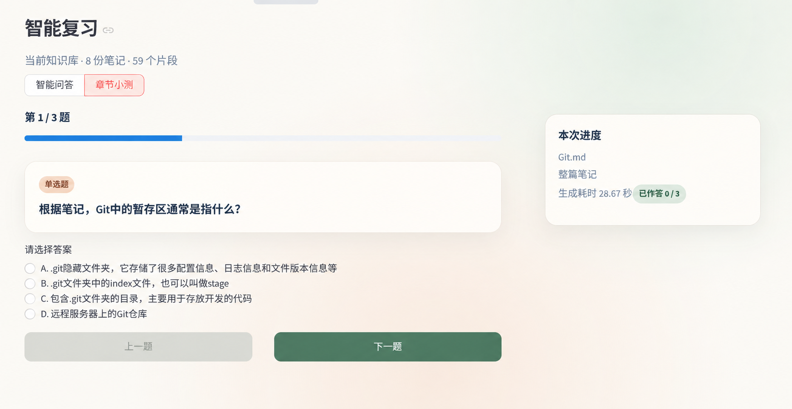
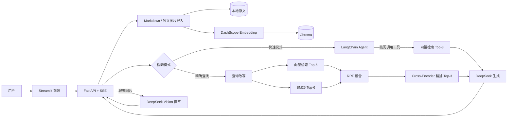
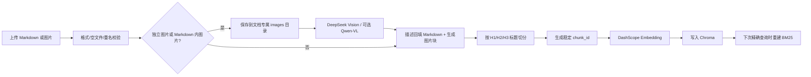

# 个人笔记复习助手

一个面向个人技术笔记的本地 RAG 学习工具。上传 Markdown、Markdown 图文 ZIP 或单张图片后，可以用自然语言提问，系统会返回带文件名、章节和原文片段的答案；没有可靠依据时明确拒答。



## 项目亮点

- **回答可追溯**：答案附带来源文件、标题路径和原文片段，不只返回模型文本。
- **两条检索链路**：快速模式由 Agent 按需检索；精确模式固定执行混合检索与精排。
- **面向中文笔记**：BM25 使用 `pkuseg` 分词，并与向量检索进行 RRF 排名融合。
- **资料不足拒答**：检索结果不可靠时提示补充笔记，不使用联网知识强行回答。
- **本地数据持久化**：原始 Markdown、导入图片、Chroma 向量索引和 BM25 索引均保存在本机。
- **流式交互**：FastAPI 通过 SSE 返回检索阶段、来源、回答 token 和耗时。
- **BYOK 成本隔离**：每位用户在页面填写自己的 DeepSeek Key，后端按请求使用，不落库、不写日志。
- **余额查询**：Key 验证通过后，每次进入设置页会自动查询并显示当前 DeepSeek 总余额。
- **多模态图片检索**：支持 Markdown 内图片和独立图片笔记；图片保存在本地并生成可检索描述，命中来源后可查看原图。聊天图片也会先转成描述，再参与当前 RAG 模式。

> 当前版本是单机 MVP：支持 `.md`、`.zip`、`.jpg`、`.jpeg`、`.png`、`.webp` 导入；ZIP 中必须包含一份 Markdown，可同时携带配套图片。章节小测、通用批量导入、笔记更新和多用户能力尚未实现。

## 双模式设计

| 模式 | 真实链路 | 适用场景 | 主要取舍 |
| --- | --- | --- | --- |
| 快速模式 `fast` | Agent 判断是否检索 → Chroma 向量 Top-3 → 基于片段回答 | 日常复习、普通追问、短对话 | 延迟较低，但弱关键词问题可能漏召回 |
| 精确查找 `accurate` | 查询改写 → 向量 Top-6 + BM25 Top-6 → RRF → Cross-Encoder → Top-3 → 生成 | 术语查找、命令定位、强调来源的问题 | 召回更稳，但首次需下载精排模型，耗时更高 |

快速模式具有进程内会话记忆；精确模式每次固定执行完整链路，不使用会话记忆。

## 技术架构



### 笔记导入流程



## 核心代码地图

| 模块 | 文件 | 负责内容 |
| --- | --- | --- |
| API 入口 | `backend/app/main.py` | 注册健康检查、笔记和问答路由 |
| 笔记导入 | `backend/app/api/notes.py` | 上传校验、保存、切分、向量化与失败回滚 |
| 双模式编排 | `backend/app/services/rag_service.py` | 快速/精确分流、阈值判断、混合检索与生成 |
| 快速 Agent | `backend/app/services/agent_service.py` | 工具调用、向量 Top-3、会话记忆和流式事件 |
| Markdown 切分 | `backend/app/services/note_splitter.py` | 标题感知切分和稳定 `chunk_id` |
| 混合检索 | `bm25_retriever.py` / `rrf_fusion.py` | 中文关键词召回与排名融合 |
| 精排 | `backend/app/services/reranker.py` | `BAAI/bge-reranker-base` Cross-Encoder 精排 |
| 向量存储 | `backend/app/storage/vector_store.py` | DashScope Embedding 和 Chroma 持久化 |
| 前端 | `streamlit_demo.py` | 导入、模式切换、来源卡片、数据看板和耗时展示 |
| 回归评测 | `eval_10questions.py` | 双模式逐题请求、规则判定和 Markdown 报告生成 |

## 回归评测

仓库提供一份 10 题轻量回归脚本。它不是通用 RAG 准确率评测：其中 9 题可按“来源文件是否命中”或“是否出现拒答措辞”自动判定，第 10 题需要人工检查回答质量。

一次本机回归快照（2026-08-24）：

| 模式 | 可自动判定题 | 规则命中 | 未命中案例 |
| --- | ---: | ---: | --- |
| 快速模式 | 9 | 7/9 | 2 道资料不足问题未按预期拒答 |
| 精确查找 | 9 | 9/9 | 无 |

完整逐题结果见 [`eval_result_20260824_010958.md`](eval_result_20260824_010958.md)。这里的 `9/9` 表示当前规则命中，不等同于答案准确率、召回率或生产环境指标；单次耗时也会受到网络、模型缓存和 API 状态影响。

### 三层评测（最新，`eval_rag.py`）

`eval_rag.py` 做「检索层 + 生成层 + 应用层」三层评测：固定 31 道题（覆盖 Git/Docker/Linux/Maven/Vue + 拒答边界题，分 easy/medium/hard 三档难度），对快速 / 精确两种模式各问一遍，自动判定 Recall@3、MRR、拒答和延迟；忠实度用 DeepSeek 作裁判（LLM-as-judge，仅作定性参考）。

一次本机评测快照（2026-09-08）：

| 模式 | Recall@3 | MRR | 拒答 | 平均延迟 |
| --- | ---: | ---: | ---: | ---: |
| 快速模式 | 28/28 | 1.0 | 2/3 | ~3.6s |
| 精确查找 | 28/28 | 0.982 | 3/3 | ~13.2s |

**按难度分层**（来源命中题）：两种模式在 easy / medium / hard 三档均为满分（easy 5/5、medium 18/18、hard 5/5）。

**说明**：31 题里 28 道为「来源命中」题、3 道为「应拒答」题。两种模式的来源命中（Recall@3）均满分；拒答上精确模式 3/3 正确、快速模式 2/3（有 1 题未按预期拒答，如实记录）。延迟符合「快速≈快、精确≈慢（更准）」的双模式取舍设计。忠实度由 LLM 裁判评估、分数波动较大，仅作定性参考，不视为生产指标。

> 均为本地固定题集、小规模、人工复核，不等同于线上生产指标。

### 这份结果如何跑出来

1. 准备并导入与 `eval_10questions.py` 中 `QUESTIONS` 对应的脱敏 Markdown 笔记。
2. 启动后端，确保 `http://127.0.0.1:8000/api/health` 可访问。
3. 执行：

```powershell
uv run python eval_10questions.py
```

4. 脚本对每道题分别请求 `fast` 和 `accurate` 模式，解析 SSE 中的来源与回答。
5. `file:xxx` 检查来源文件名，`refuse` 检查拒答关键词，`any` 留给人工判断。
6. 运行后生成 `eval_result_YYYYMMDD_HHMMSS.md`，还需人工复核回答是否真的被来源支持。

> 出于隐私考虑，个人笔记和本地索引未提交到仓库，因此新克隆项目不能直接复现上述固定分数。请先替换为自己的脱敏测试笔记，并相应修改 `QUESTIONS`。

## 从零运行

### 1. 环境要求

- Windows 10/11（仓库提供 Windows 一键启动脚本）
- Python `3.12.x`
- [uv](https://docs.astral.sh/uv/)
- 可访问 DeepSeek、DashScope 和 Hugging Face

默认轻量依赖会让精确模式降级为“混合检索 + RRF”。如需 Cross-Encoder 精排，请按 `requirements.txt` 顶部注释安装 `sentence-transformers` 和 `torch`；首次使用会下载 `BAAI/bge-reranker-base`。

### 2. 克隆并安装依赖

```powershell
git clone https://gitee.com/yuyuyuoo55/personal-note-review-assistant.git
cd personal-note-review-assistant
uv venv --python 3.12
uv pip install -r requirements.txt
```

### 3. 配置环境变量

```powershell
Copy-Item .env.example .env
```

`.env` 由部署者维护，不填写用户 DeepSeek Key。至少配置 Embedding：

```dotenv
DASHSCOPE_API_KEY=YOUR_API_KEY_HERE
```

如需启用部署者付费的 Qwen-VL 后备，可配置：

```dotenv
VLM_FALLBACK_TO_QWEN=false
```

默认不启用后备。若开启 `VLM_FALLBACK_TO_QWEN=true`，DeepSeek 图片识别失败后会使用部署者的 DashScope Key，相关费用由部署者承担。OSS 旧配置可以保留，但已不参与图片主链路。

不要把真实 Key 写入 README、截图、日志或 Git 提交。

### 4. 启动项目

推荐双击根目录的 `启动项目.cmd`。启动器会：

- 检查 8000、8501 端口；
- 后台启动 FastAPI 与 Streamlit；
- 写入 `logs/backend.log`、`logs/frontend.log`；
- 打开 `http://127.0.0.1:8501`。

也可以手动启动。第一个 PowerShell：

```powershell
uv run uvicorn backend.app.main:app --host 127.0.0.1 --port 8000
```

第二个 PowerShell：

```powershell
uv run streamlit run streamlit_demo.py --server.address 127.0.0.1 --server.port 8501
```

访问地址：

- 前端：`http://127.0.0.1:8501`
- API 文档：`http://127.0.0.1:8000/docs`
- 健康检查：`http://127.0.0.1:8000/api/health`

### 5. 使用步骤

1. 在侧边栏填写自己的 DeepSeek API Key，点击“验证 Key”；验证通过后控件才会解锁。
2. 上传一份非空 `.md` 笔记、一张 `.jpg`、`.jpeg`、`.png`、`.webp` 图片，或一个包含一份 Markdown 与配套图片的 `.zip`。
3. 文档包含本地图片时，建议将图片放入 Markdown 同级的 `images/` 目录，并保持 `` 相对路径后整体压缩为 ZIP。
4. 点击“导入文件”，等待图片描述、切分与向量化完成。旧文档中的本地绝对路径会在 ZIP 内按唯一文件名尝试匹配。
4. 选择“快速模式”或“精确查找”，输入问题查看回答与来源。
5. 如需用图片查笔记，在聊天输入框下方选择图片并输入问题；系统会把图片描述与问题一起用于当前 RAG 模式。

用户 Key 只保存在当前 Streamlit `session_state`，并通过 `X-DeepSeek-API-Key` 请求头传给后端；不会写入数据库、配置文件或日志。

同名文件会返回 409；当前版本不支持覆盖导入，请先在本机数据目录中处理旧数据后再导入。

## 测试与验证

```powershell
uv run pytest -q
```

当前自动化测试包含：

- `GET /api/health` 健康检查；
- logger 命名行为。

本仓库当前验证结果见实际执行输出。测试覆盖缺 Key、Key 验证、图片参与 RAG、错误降级、本地图片块、独立图片清单恢复、模型实例隔离和 Key 不落日志；所有外部 API 均使用 Mock，不产生费用。

多模态回归用例位于 `tests/test_multimodal.py`：验证图片描述会与用户问题拼接并进入 RAG，同时检查本地图片块及来源 metadata。

## 工程结构

```text
Personal_Notes_Review_Assistant/
├─ backend/
│  └─ app/
│     ├─ api/                 # FastAPI 路由
│     ├─ core/                # 配置与日志
│     ├─ schemas/             # 请求/响应 DTO
│     ├─ services/            # 切分、检索、融合、精排、Agent、生成
│     └─ storage/             # Chroma 与 Embedding
├─ streamlit_demo.py          # 本地与 Streamlit Cloud 共用的 Streamlit 前端
├─ frontend/app.py            # FastAPI 分离部署版前端（保留）
├─ tests/                     # 工程烟雾测试
├─ docs/images/               # README 展示图片
├─ eval_10questions.py        # 双模式回归脚本
├─ eval_result_*.md           # 单次评测快照
├─ start_all.ps1              # Windows 启动器
├─ 启动项目.cmd               # 双击入口
├─ pyproject.toml             # uv 项目与依赖配置
└─ .env.example               # 脱敏配置模板
```

运行时会创建 `data/uploads`、`data/chroma`、`data/bm25` 和 `logs`。这些目录以及 `.env` 已加入 `.gitignore`，不会上传个人笔记、索引、日志或密钥。

## API

| 方法 | 路径 | 说明 |
| --- | --- | --- |
| `GET` | `/api/health` | 健康检查 |
| `GET` | `/api/notes` | 查询已导入笔记及片段数 |
| `POST` | `/api/notes/import` | 上传 `.md`、图文 `.zip` 或单张图片，表单字段名为 `file` |
| `POST` | `/api/chat` | SSE 问答；支持 `fast` / `accurate` 模式 |
| `POST` | `/api/chat/image` | multipart 图片 RAG；字段为 `query`、`image`、`mode` 和 `conversation_id` |
| `POST` | `/api/key/validate` | 验证请求头中的 DeepSeek Key，不保存 Key |
| `GET` | `/api/key/balance` | 查询当前 DeepSeek 总余额，不保存 Key |

`/api/notes/import`、`/api/chat` 和 `/api/chat/image` 都要求请求头：

```http
X-DeepSeek-API-Key: YOUR_API_KEY_HERE
```

`POST /api/chat` 请求示例：

```json
{
  "query": "Git 的分支有什么用？",
  "mode": "accurate",
  "conversation_id": "your-session-id"
}
```

## 已知边界

- 支持单个 Markdown、单张图片或“一份 Markdown + 配套图片”的 ZIP；暂不支持 RAR、PDF、通用批量导入和更新。
- 单个 `.md` 无法携带用户电脑上的本地图片文件；文档图片增强支持公网 HTTPS 图片和 data URI，本地绝对路径会提示后跳过。
- 本地保存或 VLM 单图失败不会中断整篇文档，但该图片不会获得可检索描述。
- 快速模式会话记忆保存在进程内，后端重启后清空。
- 精确模式的 Cross-Encoder 首次加载较慢，且当前没有最低精排分阈值。
- 自动评测依赖特定测试笔记，固定分数不能直接迁移到其他知识库。
- 当前没有用户系统、权限隔离、云端同步或生产部署配置。
- 章节小测仍是界面中的下一阶段规划，不属于已实现能力。

## 安全说明

- `.env`、个人笔记、向量索引、BM25 索引和日志默认不提交。
- 用户 DeepSeek Key 只存在当前页面会话与单次请求内存中，不入库、不写日志、不拼进 Prompt。
- 部署者 DashScope Key 只由后端 `.env`/Streamlit Secrets 读取，绝不返回前端；OSS 旧配置不再参与图片链路。
- 上传前请先移除笔记中的姓名、账号、公司内部信息等隐私内容。
- 模型问答与向量化会调用外部 API；敏感资料不应直接导入。
- 项目不联网搜索补充答案，但模型服务本身仍是外部依赖。
