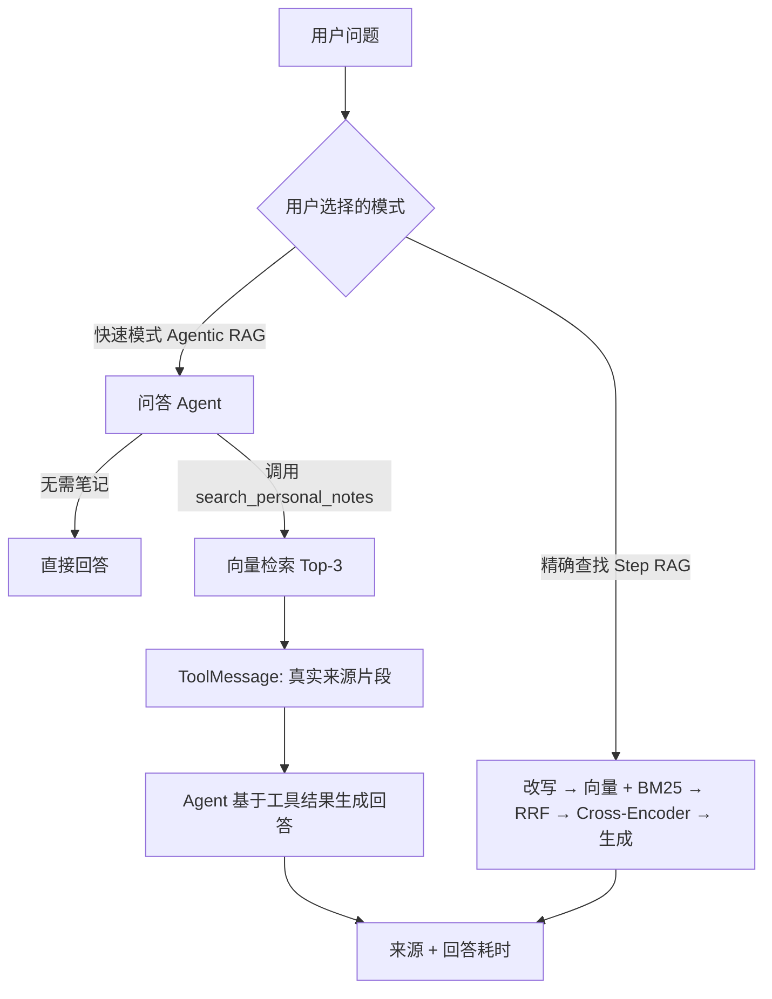
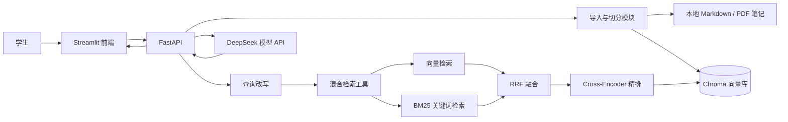
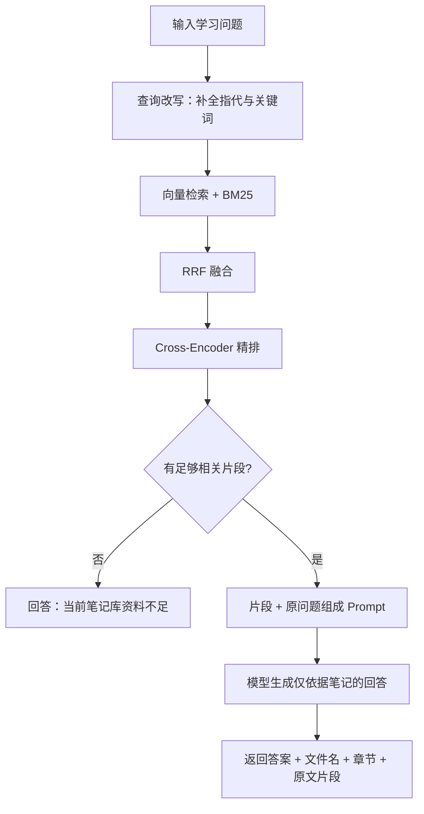
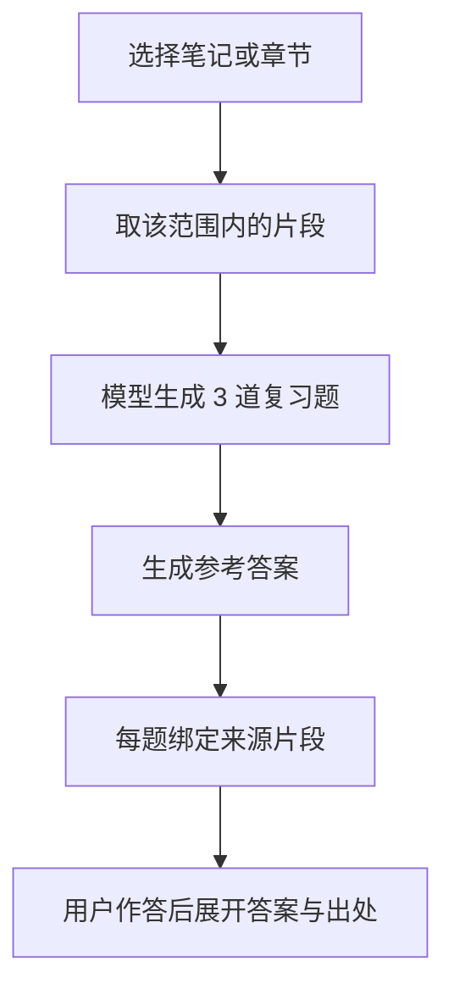
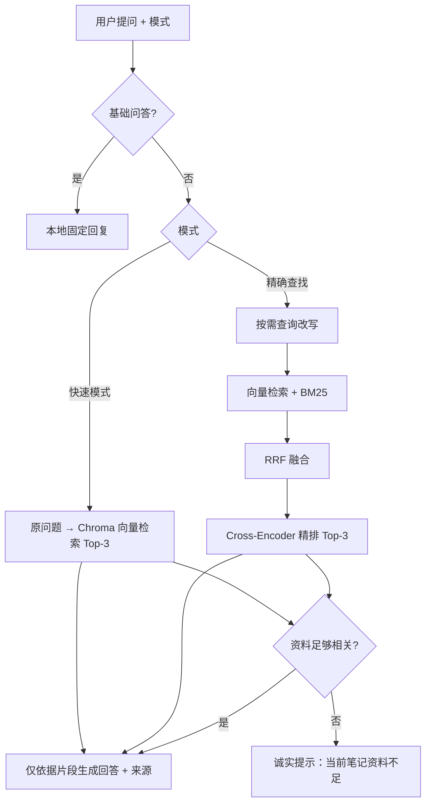

# 个人笔记复习助手：架构与流程图

## v1.1 单 Agent 工具调用流程

说明：只有快速模式由 Agent 自主决定是否使用工具；精确查找是固定 Step RAG，不是第二个 Agent。

## v1 架构

## 问答流程

## 小测流程

## 技术边界

| 模块 | v1 做法 | 现在不做 |
| --- | --- | --- |
| 切分 | Markdown 标题感知切分；PDF 先用普通文本切分 | 父子检索、复杂解析 |
| 检索 | 查询改写 + 向量检索 + BM25 + RRF + Cross-Encoder 精排 | RAGAS 评估、父子检索 |
| 生成 | 仅依据最终片段回答并附来源；后续可让 Agent 路由问答与小测工具 | 多轮循环、联网搜索 |
| 数据 | 本地个人笔记 | 多用户与云端同步 |
# 双模式问答架构（v1.1）

**关键边界：** 快速模式不调用查询改写、BM25、RRF 或 Cross-Encoder；精确查找才使用完整混合检索链路。
